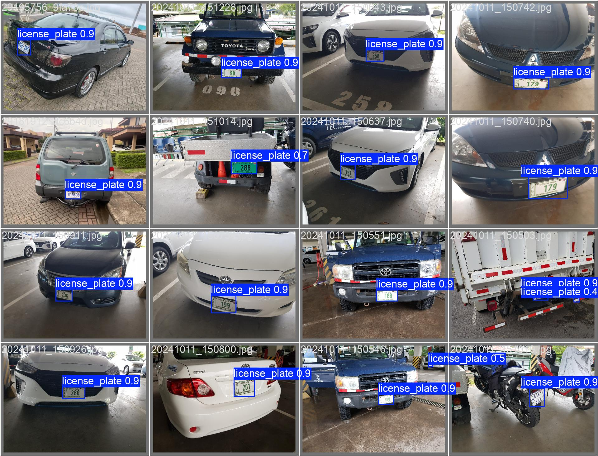
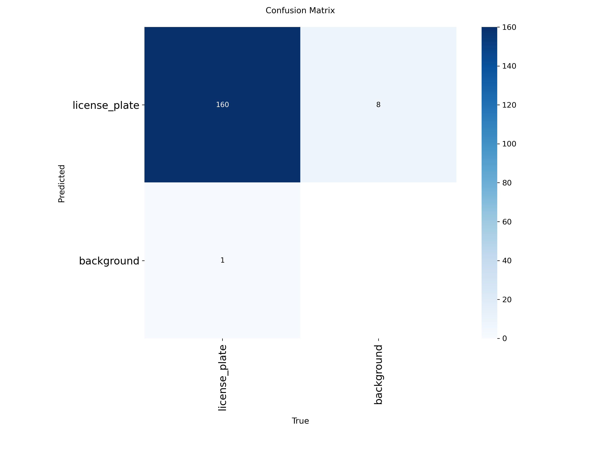

# TFG-ANPR

## Revisión general:

La detección y reconocimiento de números de placas en este proyecto
es realizada mediante YOLO11 (detección) y PaddleOCR (reconocimiento).

### Detección de placa con YOLO:




### Reconocimiento de placa con PaddleOCR:

## Código fuente:

El programa labelme_formatter da formato a un directorio dataset que contiene
imágenes y etiquetas de entrenamiento y validación.

Argumentos:
-i, --images_dir: Ruta donde las imágenes etiquetadas se encuentran. \
-l, --labels_dir: Ruta donde los etiquetas (.json) se encuentran. \
-o, --output_dir: Ruta donde se guardará el conjunto de datos.

```bash

python labelme_formater.py --images_dir path/to/images/ --labels_dir path/to/labels

```

El programa data_syntesis.py genera imágenes de placas sintéticas.

Argumentos: 
-q, --quantity: Cantidad de imágenes a generar. \
-s, --save_directory: Ruta donde guardar las imágenes. \
-a, --augmented_data: Permite aplicar aumentado de datos a la placa completa. \
-r, --augmented_plates: Permite aplicar aumentado de datos a las plantillas 
de caracteres y placa.


```bash

python data_syntesis.py

```

Plate_detection.py permite entrenar, validar y testear modelos YOLO.

Argumentos:
-y, --yolo_model: Ruta al modelo base YOLO. \
-d, --dataset_path: Ruta a archivo data.yaml que indica a YOLO
donde encontrar los datos que necesita. \
-t, --train: Entrena el modelo. \
-v, --validation: Evalúa el desempeño del modelo. \
-p, --prediction: Ruta a una imagen a predecir.

```bash

python plate_detection.py

```

El resto de programas son utilidades.

camara.py accede a una cámara disponible para probar el modelo en tiempo real.

plate_generator.py contiene toda la lógica de generación de placas
que requiere data_syntesis.py

plate_crop.py es una herramienta para recortar placas de imágenes. 
Esto alinea las placas. Las placas recortadas se editan luego par
ser usadas por plate_generator.py

font_formater.py da estructura en directorios a las imágenes
editadas, que serán usadas por plate_generator.py
sintética 

Los archivos \*\_compare.sh y \*\_train.sh son configuraciones
Slurm para ejecutar evaluaciones de modelos y entrenamiento 
usando cluster CENAT.

En el directorio doc se encuentran las actividades y tesis.

### Nota: Debe editar estos archivos .sh acorde a su necesidad si desea usarlos.

## Herramientas y flujo de trabajo:

La herramienta para etiquetado de datos es labelme. Los datos
son etiquetados para placa completa y como etiqueta se usa el 
número de placas.

Si desea agregar más casos de placas sintéticas primero recorte y alinee una imagen
para extraer la placa -puede usar plates_crop.py
si lo desea-. Es preferible que este recorte quede en tamaño 440x140px. 
Luego en Krita abra la imagen y recorte en layers separados caracteres en tamaño
50x70px para automóviles, y 48x42px para motocicletas. 
Recorte los caracteres por su forma, de manera que quede el fondo transparente.
Pinte los caracteres recortados en color azul RGB=(0,0,255). 
Luego pinte la base de la placa para eliminar los caracteres. 
Pinte la base de la placa en color blanco RGB=(255,255,255).
Si lo desea puede crear también copias de las capas para guardas los caracteres y la plantilla 
en su color original. Renombre las capas de caracter acorde a cada caracter; ejemplo, 
si la placa era AAB-122, renombre las capas a A_1, A_2, -\_1, 1_1, 2_2, 2_2.
Renombre la placa base a Template_1, Template_2, etc. En la opción tool->export layers, seleccione
guardar imagen según tamaño de cada layer, exportar en modo batch y en formato .png. 
Finalmente en el directorio donde se guardó los recortes guarde un archivo llamado place_holder.txt 
donde en cada línea guarde la posición donde se encontraba en la imagen original el caracter recortado;
guarde en formato x,y donde x,y representa el centro de la imagen; deben ser números enteros.

Video explicativo AGREGAR LUEGO UN VIDEO.

## Enlaces:

Formulario para solicitar uso de GPUs del cluster del CENAT: 
https://kabre.cenat.ac.cr/registro

Enlace a conjunto de datos de entrenamiento y validación: 
https://drive.google.com/drive/folders/1u3_154EAZ3iBe3Ww7dtA7ucIXfgrR926?usp=drive_link

Enlace imágenes editadas para la generación sintéticas de datos: 
https://drive.google.com/drive/folders/1M5UaEjmORhWFyDbkEDYt03YD_wYNTvH7?usp=drive_link

## Referencias:

Código base del reconocimiento de placas: 
https://github.com/lawrencexli/USLicensePlateOCR.git

