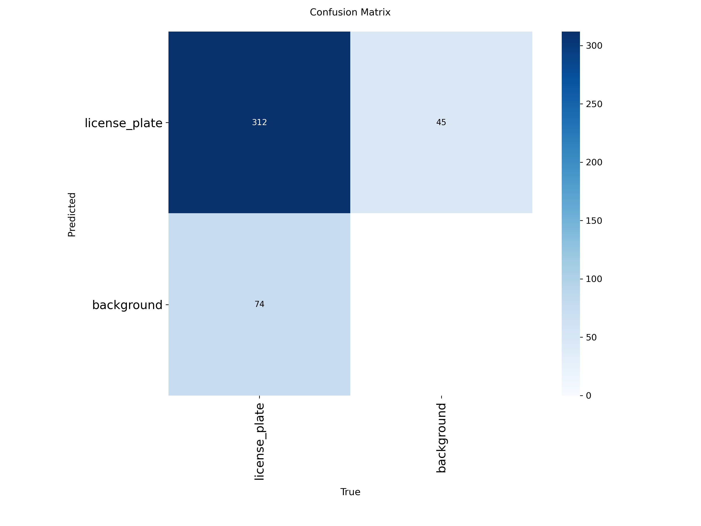
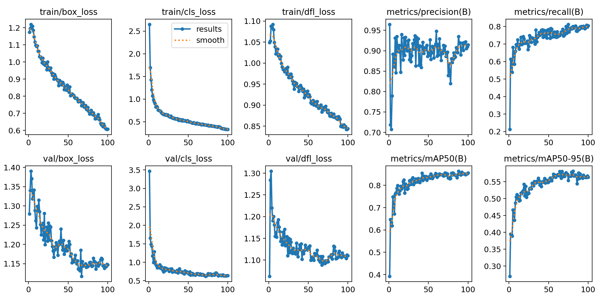
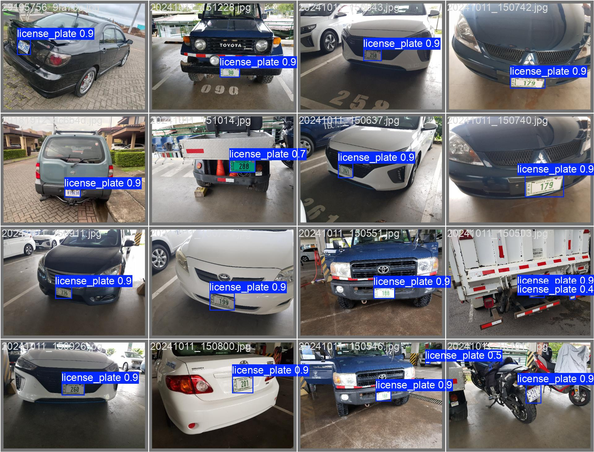
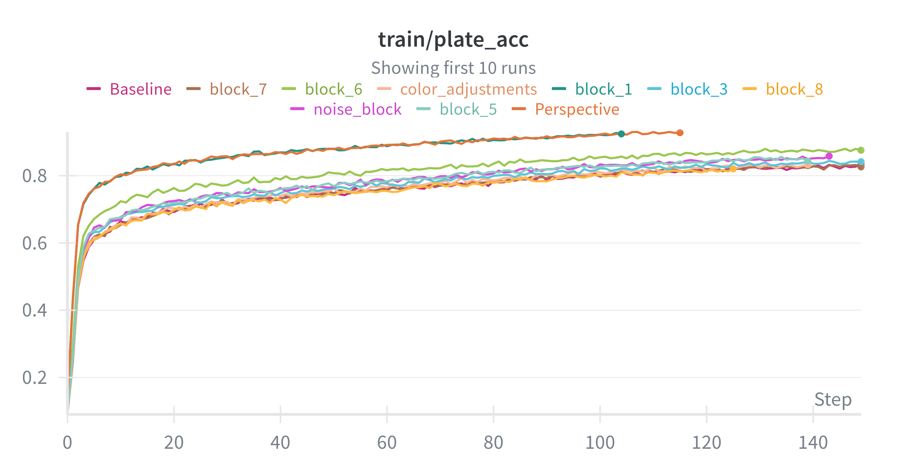
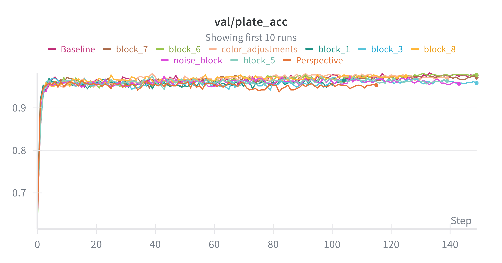
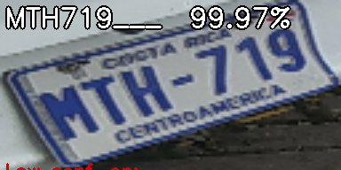
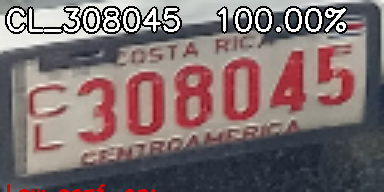
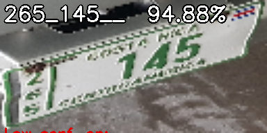
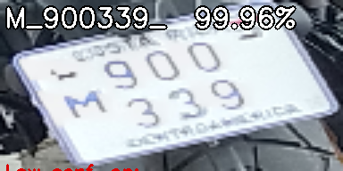
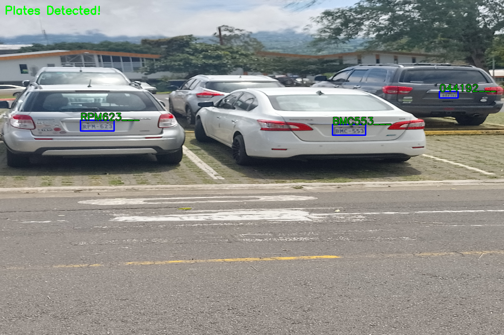

# TFG-ANPR

## Revisión general:

La detección y reconocimiento de números de placas en este proyecto
es realizada mediante YOLO11 (detección) y Fast-Plate-OCR (reconocimiento).

### Detección de placa con YOLO:

#### Matriz de confusión del mejor modelo de detección de placas (YOLO11 nano)


#### Curvas de aprendizaje del mejor modelo de detección de placas (YOLO11 nano)


#### Ejemplos de detección de placas vehiculares 


### Métricas obtenidas


| Modelo                         | Precisión | Exhaustividad | mAP   |
| ------------------------------ | --------- | ------------- | ----- |
| Modelo base                    | 0.811     | 0.703         | 0.814 |
| YOLO propuesto (Conjunto 3)    | 0.935     | 0.806         | 0.946 |


### Reconocimiento de placa con Fast-Plate-OCR:

#### Curvas de aprendizaje del mejor modelo de reconocimiento de placas (Fast-Plate-OCR XS)



#### Ejemplos de reconocimiento de placas vehiculares 

<div style="display: flex; flex-wrap: wrap; gap: 10px;">
  
  
  
  
</div>

### Métricas obtenidas


| Modelo                     | Precisión de placa | Precisión de longitud |
| -------------------------- | ------------------ | ---------------------- |
| Fast-Plate-OCR sin ajuste | 0.755              | 0.807                 |
| OCR propuesto             | 0.984              | 0.997                 |


### Integración del sistema


#### Ejemplos de reconocimiento de placas vehiculares 


#### Métricas obtenidas
Hadware utilizado para pruebas

##### Configuración del sistema

| Parámetro      | Valor                               |
| -------------- | ----------------------------------- |
| Sistema operativo | Arch Linux x86_64                |
| Procesador        | Intel i5-7200U (4 núcleos, 3.10 GHz) |
| GPU               | Intel HD Graphics 620            |
| Memoria RAM       | 8 GB DDR4                        |
| Disco             | HDD 930 GB (btrfs)               |


##### Resultados de desempeño

| Métrica                       | Valor               |
| ---------------------------- | ------------------- |
| Latencia promedio por cuadro | 299.6 ± 69.7 ms     |
| Latencia mínima              | 174.11 ms           |
| Latencia máxima              | 430.68 ms           |
| Velocidad promedio           | 3.84 ± 0.79 FPS     |
| Cuadros procesados           | 4758                |
| Cuadros con detección        | 2047 (43.0%)        |
| Videos analizados            | 13                  |


## Código fuente:

El programa labelme_formatter da formato a un directorio dataset que contiene
imágenes y etiquetas de entrenamiento y validación.

Argumentos:
-i, --images_dir: Ruta donde las imágenes etiquetadas se encuentran. \
-l, --labels_dir: Ruta donde los etiquetas (.json) se encuentran. \
-o, --output_dir: Ruta donde se guardará el conjunto de datos.

```bash

python labelme_formater.py --images_dir path/to/images/ --labels_dir path/to/labels

```

El programa data_syntesis.py genera imágenes de placas sintéticas.

Argumentos: 
-q, --quantity: Cantidad de imágenes a generar. \
-s, --save_directory: Ruta donde guardar las imágenes. \
-a, --augmented_data: Permite aplicar aumentado de datos a la placa completa. \
-r, --augmented_plates: Permite aplicar aumentado de datos a las plantillas 
de caracteres y placa.


```bash

python data_syntesis.py

```

El resto de programas son utilidades.

plate_generator.py contiene toda la lógica de generación de placas
que requiere data_syntesis.py

font_formater.py da estructura en directorios a las imágenes
editadas, que serán usadas por plate_generator.py
sintética 

Los archivos \*\_train.sh son configuraciones
Slurm para ejecutar entrenamientos
usando cluster CENAT.

En el directorio doc se encuentran las actividades y tesis.

### Nota: Debe editar estos archivos .sh acorde a su necesidad si desea usarlos.

## Herramientas y flujo de trabajo:

La herramienta para etiquetado de datos es labelme. Los datos
son etiquetados para placa completa y como etiqueta se usa el 
número de placas.

Si desea agregar más casos de placas sintéticas primero recorte y alinee una imagen
para extraer la placa -puede usar plates_crop.py
si lo desea-. Es preferible que este recorte quede en tamaño 440x140px. 
Luego en Krita abra la imagen y recorte en layers separados caracteres en tamaño
50x70px para automóviles, y 48x42px para motocicletas. 
Recorte los caracteres por su forma, de manera que quede el fondo transparente.
Pinte los caracteres recortados en color azul RGB=(0,0,255). 
Luego pinte la base de la placa para eliminar los caracteres. 
Pinte la base de la placa en color blanco RGB=(255,255,255).
Si lo desea puede crear también copias de las capas para guardas los caracteres y la plantilla 
en su color original. Renombre las capas de carácter acorde a cada carácter; ejemplo, 
si la placa era AAB-122, renombre las capas a A_1, A_2, -\_1, 1_1, 2_2, 2_2.
Renombre la placa base a Template_1, Template_2, etc. En la opción tool->export layers, seleccione
guardar imagen según tamaño de cada layer, exportar en modo batch y en formato .png. 
Finalmente en el directorio donde se guardó los recortes guarde un archivo llamado place_holder.txt 
donde en cada línea guarde la posición donde se encontraba en la imagen original el carácter recortado;
guarde en formato x,y donde x,y representa el centro de la imagen; deben ser números enteros.

Video explicativo AGREGAR LUEGO UN VIDEO.

## Enlaces:

Formulario para solicitar uso de GPUs del cluster del CENAT: 
https://kabre.cenat.ac.cr/registro

Enlace a conjunto de datos de entrenamiento y validación: 
https://drive.google.com/drive/folders/1u3_154EAZ3iBe3Ww7dtA7ucIXfgrR926?usp=drive_link

Enlace imágenes editadas para la generación sintéticas de datos: 
https://drive.google.com/drive/folders/1M5UaEjmORhWFyDbkEDYt03YD_wYNTvH7?usp=drive_link

## Referencias:

Código base del reconocimiento de placas: 
https://github.com/ankandrew/fast-plate-ocr.git

Código base de detección de placas: 
https://github.com/ultralytics/ultralytics.git
